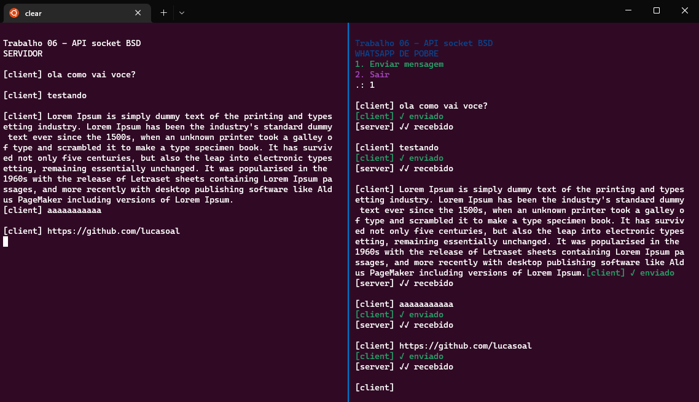

# Trabalho 06 - API socket BSD

Valor: 10 pontos

Data de entrega: 30/11/2022

Desenvolver aplicação utilizando API socket BSD.

O cliente deve enviar mensagens de texto que o usuário inserir na entrada. O servidor sempre responde com mensagem "OK", ou algo equivalente.

Para executar, abra o servidor em um terminal, que ficará mostrando as interações com cliente (não precisa haver nenhum tipo de entrada de dados no servidor). Abra outro terminal para executar o cliente, e através deste, envie mensagens para o servidor.

**Para executar:**

1. Compile os códigos: `./build`
2. Rode o servidor: `./run-server.sh`
3. Rode o cliente: `./run-client.sh`

> _Ao receber uma mensagem do cliente, o servidor envia aconfirmação de recebimento_

