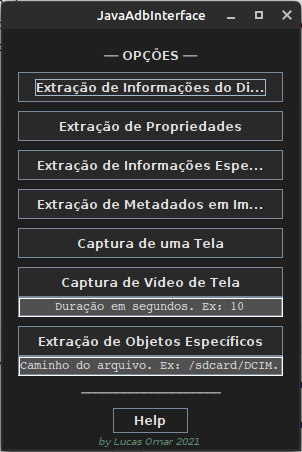
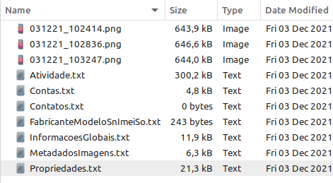

# - Java ADB Interface - [](https://dev.java/) [](https://www.android.com/intl/pt-BR_br/)

_**My first project developed with Java programming language.**_

[Working Video - Youtube](https://youtu.be/zUuKocvuwJo)

 

## About the project

The idea of the App is:

_"Development of an interface that is able to improve the experience of using the ADB tool"_

## Why?

With the spread of the use of mobile devices, notably smartphones, cell phones, tablets and IoT devices, the
extracting digital data and evidence from these devices has become fundamental in forensic activities, both
those in the judicial sphere and in investigations carried out by the Law and Security Forces

Send me an email: lucasomarandradeleal@gmail.com

Connect to my [Linkedin](https://linkedin.com/in/lucasomarandradeleal)

Feel free to use it as a study and make improvements.

***The project is opensource!!!***

## Functionalities

- **Connect to a device and extract files and device information.**

- **Device Information Extraction**
  - Global Information
  - Manufacturer
  - Model
  - Serial Number
  - IMEI
  - OS Version
- **Property Extraction**
  - Properties in general
- **Image Metadata Extraction**
  - Image metadata
- **Capture a Screen**
- **Screen Video Capture**
- **Extraction of Specific Files or Folders**

## Getting Started

### Prerequisites

To run this project in the development mode, you'll need to have a basic environment to run a Java project.

### Installing

**Cloning the Repository**

```
$ git clone https://github.com/lucasoal/JavaAdbInterface

$ cd JavaAdbInterface
```

## Built With

- [Java](https://dev.java/) - Build the native app using **Java**
- [Android Debug Bridge (ADB)](https://developer.android.com/studio/command-line/adb) - Backend application

## Support tools

- [IntelliJ IDEA](https://www.jetbrains.com/idea/) - Interface Development Environment
- [Stack Overflow](https://stackoverflow.com/) - Research and also bug fixing

## Contributing

If you have any question about the project...

Email-me: lucasomarandradeleal@gmail.com

Connect to my [Linkedin](https://linkedin.com/in/lucasomarandradeleal)

Thank you!
