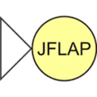

# PROJECTS WORKED AT THE COLLEGE 📚👨‍💻

*Hello! Here you can find some of the projects I worked on in college.*

---

###  Assembly
- [Assembly](./Assembly/)
    - [Assembly Inline](./Assembly/asm-inline/)
    - [Assembly Mips](./Assembly-Mips/asm-mips/)

---

###  Automatons
- [JFLAP Automaton](./JFLAP-Automatos)
    - [Stack Automaton](./JFLAP-Automatos)
    - [Turing Machine Automaton](./JFLAP-Automatos)

---

###  Shell Script
#### Network
- [ARP Mapping](./ShellScript/network/arp-mapping.sh)
- [MTU Identification](./ShellScript/network/mtu-identification.sh)

#### Tools
- [Install Useful, Remove Useless Apps](./ShellScript/tools/get-useful-rm-useless.sh)
- [Study](./ShellScript/study/)

---

###  Blender
- [Displacement](./Blender/Blender-Displacement/)
- [Reflection, Lighting and HDR](./Blender/Blender-Macaco/)
- [Normal Maps](./Blender/Blender-NormalMaps/)
- [Texture, Background and Models](./Blender/Blender-UrsoCanecaBarril/)

---

###  C
- [Parking Control](./C/C-Estacionamentos/)
- [Encryption and Decryption using Pipes and Water Mark](./C/C-Pipes/)
- [Study](./C/C-Estudo/)

---

###  C++
- [Soccer Goal](./C++/Cpp-OpenglFreeglutGol/)
- [3D Model Name](./C++/Cpp-OpenglFreeglutNome3D/)
- [Tic Tac Toe](./C++/Cpp-OpenglFreeglutTicTacToe/)

---

###  CoppeliaSim - Robots, Sensors and Applications
- [Line Tracer - Senna F1 Interlagos Circuit](./CoppeliaSim/line-tracer-Senna-F1-Interlagos-circuit/)
- [Niryo One - Object Positioning](./CoppeliaSim/niryo-one-object-positioning.ttt)
- [Pionner - Making Circuit by Sensor Orientation](./CoppeliaSim/pionner-making-circuit-by-sensor-orientation/)
- [Scara - Rotation 360 and Speed Control](./CoppeliaSim/scara-rotation-360-and-speed-controller.ttt)
- [Serial Bot - Three Joint](./CoppeliaSim/three-joint-serial-robot/)

---

###  Java
### Digital Forensics Study 🛡️
- [Cyber Security and Computer Forensics Lab Researcher](https://sites.google.com/view/cyberonelab/pessoas?authuser=0#h.9183b6clno28)
- [Hash Generator](https://github.com/lucasoal/java-GeradorHash)
- [Interface for ADB](https://github.com/lucasoal/java-ADBInterface)
- [Android API About Cities](https://github.com/lucasoal/java-AndroidGeodbAPI)
- [Study OOP](./Java/Java-EstudoPoo/)
    - [Study OOP - Pen](./Java/poo-study-pen/)
    - [Study OOP - Bank Current Account](./Java/bank-current-account//)
    - [Study OOP - Sort Dessert](./Java/sorts-dessert/)

---

###  Lisp
- [Lisp Review](./Lisp/lisp-review.pdf)

---

###  Lua
- [Max and Min Value of an Array](./Lua/array-max-min-value.lua)
- [Sort Array With BubbleSort Method](./Lua/bubblesort-array.lua)

---

###  Pascal
- [Using Matrix to Calculate a Car Route](./Pascal/calculate-route-from-matrix.pas)
- [Division by Subtraction](./Pascal/division-by-subtraction.pas)
- [Calculate Factorial With Recursive Function](./Pascal/factorial-with-recursive-function.pas)
- [Guess Value](./Pascal/guess-value.pas)
- [Sum Results](./Pascal/sum-results.pas)

---

###  Prolog
- [Calculate Gradebook](./Prolog/calculate-gradebook.pro)
- [Count Vowels From a List](./Prolog/count-vowels-from-list.pro)
- [List Based Translaction](./Prolog/list-based-translation.pro)
- [Print Elements of a List](./Prolog/print-list-elements.pro)

---

###  Python Notebook
#### Data Analysis and Manipulation
- [Introduction to Python Language](./Python/introduction-to-python-language.ipynb)
- [Python Introduction](./Python/python-introduction.ipynb)
- [Python Graphical View](./Python/graphical-view.ipynb)
- [Data Analysis](./Python/data-analysis.ipynb)
    - [Data Pre Processing](./Python/data-analysis.ipynb)
    - [Dataset Pre Processing](./Python/dataset-pre-processing.ipynb)
        - [Dataset Pre Processing 2](./Python/dataset-pre-processing.ipynb)
- [Probabilistic Models](./Python/probabilistic-models.ipynb)
    - [Probabilistic Binomial Poisson Models](./Python/probabilistic-binomial-poisson-models.ipynb)
        - [Normal Probability Distribution Model](./Python/normal-probability-distribution-model.ipynb)
- [Exploratory Analysis and Descriptive Statistics Correlation](./Python/exploratory-analysis-and-descriptive-statistics-correlation.ipynb)
    - [Exploratory Analysis and Descriptive Statistics Graphical View](./Python/exploratory-analysis-and-descriptive-statistics-graphical-view.ipynb)
- [Exploratory Analysis and Descriptive Statistics](./Python/exploratory-analysis-and-descriptive-statistics.ipynb)
    - [Exploratory Analysis and Descriptive Statistics 2](./Python/exploratory-analysis-and-descriptive-statistics2.ipynb)
- [Churn Modeling and Machine Learning Algorithms](./Python/churn-modeling-machine-learning-algorithms.ipynb)
- [Estimation Interval and Confidence Intervals](./Python/estimation-interval-confidence-intervals.ipynb)
- [Confidence Interval](./Python/confidence-interval.ipynb)
- [CNN and CIFAR10](./Python/cnn-cifar10.ipynb)
    - [CIFAR 10](./Python/cifar10.ipynb)
    - [CNN to Recognize Objects in Images](./Python/cnn-to-recognize-objects-in-images.ipynb)

---

###  SQL
- [Airport Database](./SQL/Database-Airport/)
- [Store Database](./SQL/Database-Store/)
